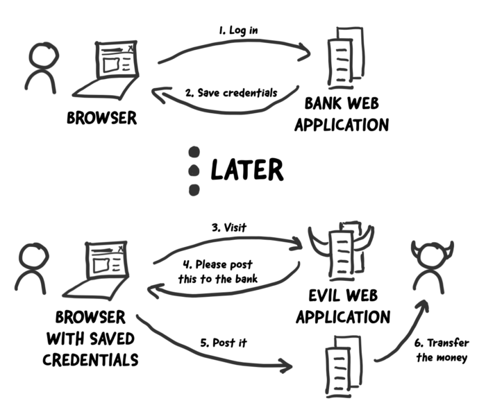

# Web App Security 

---
# Content

1. Overview
1. CSRF
1. SameSite Cookies
1. CSP
1. Discussion

---
# Overview

1. Social Engineering
1. CSRF
1. Injection
1. HTTP Sessions
1. User Management

---
# ⚡CSRF



<!-- [source](https://medium.com/tresorit-engineering/modern-csrf-mitigation-in-single-page-applications-695bcb538eec) -->

---
```html
<a href="http://www.harmless.com/" onclick="
  var f = document.createElement('form');
  f.style.display = 'none';
  this.parentNode.appendChild(f);
  f.method = 'POST';
  f.action = 'http://www.example.com/account/destroy';
  f.submit();
  return false;">To the harmless survey</a>
```

---
# 🛡️ CSRF

* Use GET for read operations only 
* Use POST/PUT/PATCH/DELETE for changing operations
* CORS
* Use CSRF tokens
* SameSite Cookies

---
# CORS - Cross-Origin Resource Sharing

---
# CSRF and Single Page Applications

* no forms
* requests through API (XMLHttpRequest, fetch())
* 

---
# SameSite Cookies

```
Set-Cookie: widget_session=abc123; SameSite=Lax; Secure
```

| SameSite | |
|--|--|
| None | disable SameSite cookie setting, requires Secure |
| Lax | GET only: top-level navigation, for third party website access |
| Strict | only sent in first-party context |

---
# Content Security Policy (CSP)

The application security Swiss Army Knife

---
# Discussion

* How to secure our web apps?

---
# Sources

- [CSRF and SPA](https://medium.com/tresorit-engineering/modern-csrf-mitigation-in-single-page-applications-695bcb538eec)
- [Rails Security Guides](https://guides.rubyonrails.org/security.html)
- [SameSite Cookies](https://web.dev/samesite-cookies-explained/)
